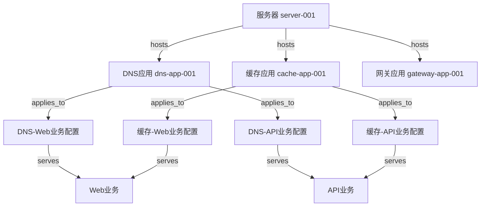
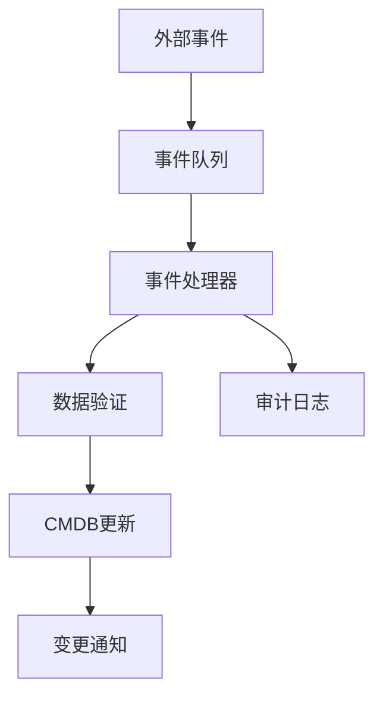
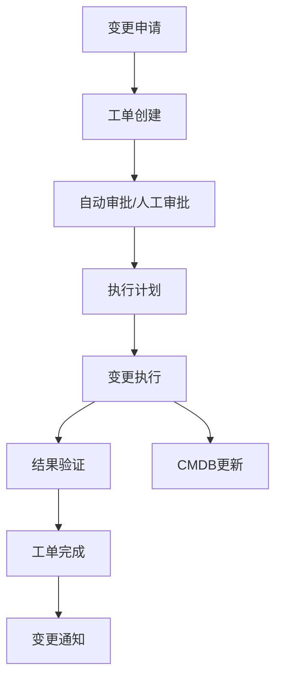
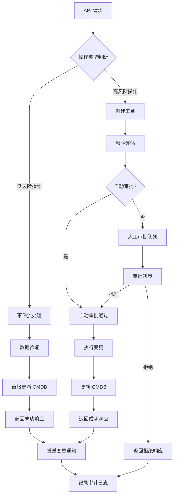
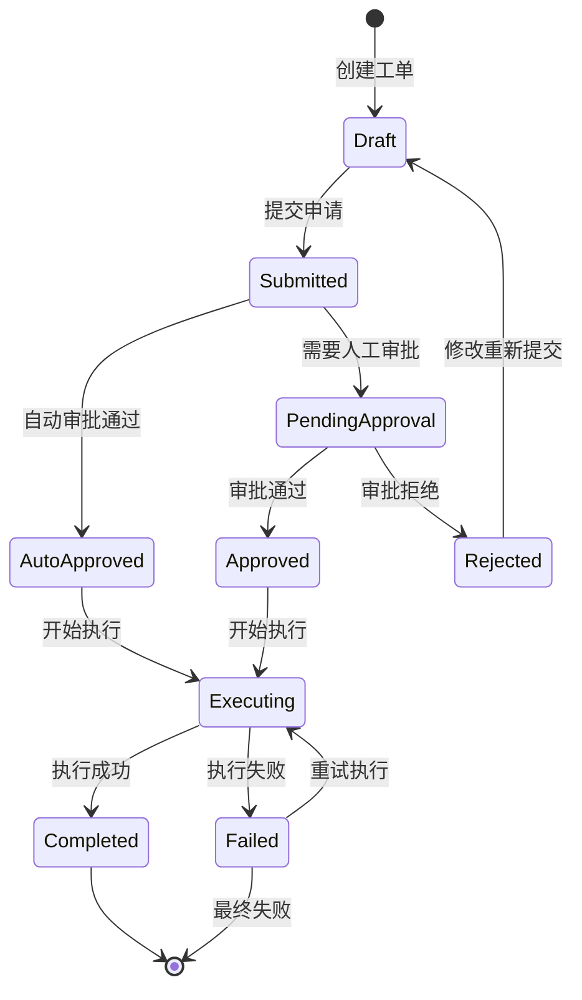

# CMDB 系统数据结构设计说明

## 📋 设计概述

基于您在 `a.md` 文档中提出的设计原则，我们设计了一个高度灵活、可扩展的 CMDB 系统。特别针对您提到的 **"资源 → 应用 → 配置（多维度关联）"** 的复杂关系场景进行了深度优化。

## 🎯 核心设计理念

### 1. 多层次抽象模型

```
资源层 (Resource Layer)
    ↓ hosts
应用层 (Application Layer)
    ↓ applies_to
配置层 (Configuration Layer)
    ↓ serves
业务层 (Business Layer)
```

### 2. 灵活关系建模

- **通用关系表** (`UniversalRelation`) - 支持任意对象类型间的关系
- **多维度关联表** (`MultiDimensionAssociation`) - 处理复杂的多对多关系
- **关系路径缓存** (`RelationPath`) - 加速复杂查询

## 🏗 数据结构设计

### 核心层 (cmdb_core.go)

#### 1. 资源表 (Resource)

```go
type Resource struct {
    ResourceID   string  // 资源唯一标识
    Name         string  // 资源名称
    Type         string  // 资源类型
    Status       string  // 资源状态
    Provider     string  // 云提供商
    Region       string  // 区域
    Zone         string  // 可用区
    Attributes   JSONMap // 扩展属性(支持异构)
    // ... 其他字段
}
```

**支持的资源类型：**

- 物理服务器 (`server`)
- CDN 节点 (`cdn_node`)
- K8s 集群 (`k8s_cluster`)
- 虚拟机 (`vm`)
- 容器 (`container`)
- 等...

#### 2. 标签系统

- `ResourceTag` - 资源标签
- `ServiceTag` - 服务标签
- `BusinessTag` - 业务标签

### 应用层 (cmdb_application.go)

#### 1. 应用类型定义 (ApplicationType)

```go
type ApplicationType struct {
    TypeName             string    // 应用类型名称
    DisplayName          string    // 显示名称
    Category             string    // 应用分类
    ResourceRequirements JSONMap   // 资源要求
    ConfigSchema         JSONMap   // 配置模板
    DefaultConfig        JSONMap   // 默认配置
    HealthCheckConfig    JSONMap   // 健康检查配置
    // ... 其他字段
}
```

**支持的应用类型：**

- DNS 服务器 (`dns_server`)
- Web 网关 (`web_gateway`)
- 缓存服务 (`cache_service`)
- CDN 边缘服务 (`cdn_edge`)
- 负载均衡 (`load_balancer`)
- 等...

#### 2. 应用实例 (Application)

```go
type Application struct {
    AppID          string   // 应用实例唯一标识
    Name           string   // 应用实例名称
    TypeID         uint     // 应用类型ID
    ResourceID     uint     // 部署的资源ID
    DeploymentType string   // 部署方式
    ListenPorts    JSONMap  // 监听端口配置
    NetworkConfig  JSONMap  // 网络配置
    ResourceUsage  JSONMap  // 资源使用情况
    // ... 其他字段
}
```

#### 3. 配置实例 (Configuration)

```go
type Configuration struct {
    ConfigID      string   // 配置唯一标识
    Name          string   // 配置名称
    ApplicationID uint     // 应用实例ID
    BusinessID    string   // 业务ID
    ServiceID     string   // 服务ID
    ConfigType    string   // 配置类型
    ConfigData    JSONMap  // 配置数据
    Priority      int      // 配置优先级
    // ... 其他字段
}
```

### 关系层 (cmdb_relations.go)

#### 1. 通用关系表 (UniversalRelation)

```go
type UniversalRelation struct {
    RelationID   string   // 关系唯一标识
    SourceType   string   // 源对象类型
    SourceID     string   // 源对象ID
    TargetType   string   // 目标对象类型
    TargetID     string   // 目标对象ID
    RelationType string   // 关系类型
    Properties   JSONMap  // 关系属性
    // ... 其他字段
}
```

**支持的关系类型：**

- `hosts` - 托管关系（资源托管应用）
- `applies_to` - 应用关系（配置应用于应用）
- `serves` - 服务关系（应用服务于业务）
- `depends_on` - 依赖关系
- 等...

#### 2. 多维度关联表 (MultiDimensionAssociation)

```go
type MultiDimensionAssociation struct {
    AssocID        string   // 关联唯一标识
    AssocType      string   // 关联类型
    PrimaryType    string   // 主对象类型（如：资源）
    PrimaryID      string   // 主对象ID
    SecondaryType  string   // 次对象类型（如：应用）
    SecondaryID    string   // 次对象ID
    TertiaryType   string   // 第三对象类型（如：配置）
    TertiaryID     string   // 第三对象ID
    QuaternaryType string   // 第四对象类型（如：业务）
    QuaternaryID   string   // 第四对象ID
    AssocConfig    JSONMap  // 关联配置
    // ... 其他字段
}
```

### 历史追踪层 (cmdb_history.go)

#### 变更历史记录

- `ResourceHistory` - 资源变更历史
- `ServiceHistory` - 服务变更历史
- `BusinessHistory` - 业务变更历史
- `RelationHistory` - 关系变更历史

#### 快照管理

- `ResourceSnapshot` - 资源快照
- `AuditConfig` - 审计配置
- `SyncLog` - 同步日志

### 缓存优化层 (cmdb_cache.go)

#### 查询优化

- `RelationCache` - 关系缓存
- `ResourceView` - 资源视图缓存
- `SearchIndex` - 搜索索引
- `QueryPerformance` - 查询性能监控

## 🔄 典型使用场景

### 场景 1：一台服务器部署多个应用，不同业务有不同配置



### 场景 2：CDN PoP 节点的复杂配置

```sql
-- 查询：某个 PoP 节点上所有应用的业务配置
SELECT
    r.name as resource_name,
    app.name as application_name,
    cfg.name as config_name,
    cfg.business_id,
    cfg.config_data
FROM cmdb_multi_dimension_associations mda
JOIN cmdb_resources r ON r.resource_id = mda.primary_id
JOIN cmdb_applications app ON app.app_id = mda.secondary_id
JOIN cmdb_configurations cfg ON cfg.config_id = mda.tertiary_id
WHERE mda.primary_type = 'resource'
  AND mda.secondary_type = 'application'
  AND mda.tertiary_type = 'configuration'
  AND r.resource_id = 'pop-node-beijing-001';
```

## 🚀 核心优势

### 1. **高度灵活性**

- JSONMap 扩展属性支持异构资源
- 通用关系表支持任意对象间关系
- 多维度关联表处理复杂场景

### 2. **强可扩展性**

- 元数据驱动的资源类型定义
- 标签化管理，支持动态分类
- 配置模板系统，支持快速部署

### 3. **性能优化**

- 关系路径缓存加速图查询
- 预计算的统计数据
- 搜索索引优化全文检索

### 4. **完整追踪**

- 完整的变更历史记录
- 版本管理和快照功能
- 审计日志和同步状态

### 5. **业务友好**

- 支持多租户隔离
- 环境分离（prod/test/dev）
- 优先级和权重管理

## 📝 实施建议

### 1. **分阶段实施**

1. 第一阶段：实现核心资源层
2. 第二阶段：添加应用层和配置层
3. 第三阶段：完善关系层和缓存层
4. 第四阶段：增强历史追踪和监控

### 2. **数据迁移策略**

```go
// 支持从现有系统逐步迁移
func migrateFromLegacySystem() {
    // 1. 迁移基础资源数据
    // 2. 建立应用和配置关联
    // 3. 构建关系图
    // 4. 验证数据完整性
}
```

### 3. **API 设计原则**

- RESTful API 设计
- GraphQL 支持复杂查询
- 实时 WebSocket 通知
- 批量操作接口

## 🔄 数据变更驱动机制设计

### 核心设计原则

基于 CMDB 系统的特点，我们采用 **事件流 + 工单驱动的混合模式**，确保数据变更的可控性、可追溯性和合规性。

### 1. 变更分类与驱动策略

#### 📡 事件流驱动（Event-Driven）

**适用场景：** 自动化、实时性、高频变更

- **资源状态同步** - 云资源状态变更、健康检查结果
- **应用运行时数据** - 进程状态、资源使用率、性能指标
- **监控事件** - 告警触发、恢复通知
- **系统自动发现** - 新资源发现、拓扑变化
- **API 自动上报** - 监控系统上报资源状态、性能指标
- **批量同步操作** - 定时同步云平台资源信息



#### 📋 工单驱动（Workflow-Driven）

**适用场景：** 人工操作、重要变更、需要审批

- **业务配置变更** - 应用配置修改、业务关联调整
- **资源生命周期** - 资源创建、删除、重要属性修改
- **关系变更** - 依赖关系建立、服务关联调整
- **批量操作** - 大规模配置变更、数据迁移
- **API 手动操作** - 用户通过 API 手动创建、修改、删除资源
- **外部系统集成** - 第三方系统通过 API 进行资源管理



### 2. 技术架构选型

#### 事件流技术栈

```yaml
消息队列:
  - Apache Kafka (推荐) - 高吞吐量、持久化、分区
  - Redis Streams (轻量级) - 简单部署、内存高速
  - RabbitMQ (传统) - 成熟稳定、功能丰富

事件处理:
  - Event Sourcing - 事件溯源模式
  - CQRS - 命令查询分离
  - Saga Pattern - 分布式事务

数据序列化:
  - Protocol Buffers - 高性能、跨语言
  - Avro - Schema演进、Kafka生态
  - JSON - 简单易用、调试友好
```

#### 工单流引擎

```yaml
工作流引擎:
  - Temporal (推荐) - 现代化、容错、可视化
  - Cadence - 成熟稳定、Uber开源
  - Zeebe - 微服务友好、云原生
  - 自研轻量级 - 基于状态机

审批系统:
  - 多级审批链
  - 条件路由
  - 并行审批
  - 自动审批规则

状态管理:
  - 草稿 → 待审批 → 执行中 → 完成/失败
  - 支持暂停、回滚、重试
```

### 3. API 操作场景设计

#### 🔗 API 驱动场景分类

**根据操作类型和风险级别，API 操作分为以下几类：**

| API 操作类型 | 驱动方式 | 审批级别 | 处理方式 | 示例场景                |
| ------------ | -------- | -------- | -------- | ----------------------- |
| **资源上报** | 事件流   | 无需审批 | 实时处理 | 监控 Agent 上报资源状态 |
| **状态更新** | 事件流   | 无需审批 | 实时处理 | API 更新资源健康状态    |
| **标签管理** | 事件流   | 自动审批 | 准实时   | API 添加/删除资源标签   |
| **资源创建** | 工单     | 人工审批 | 异步处理 | API 创建新的服务器资源  |
| **配置变更** | 工单     | 人工审批 | 异步处理 | API 修改应用配置        |
| **关系建立** | 工单     | 人工审批 | 异步处理 | API 建立资源依赖关系    |
| **资源删除** | 工单     | 高级审批 | 异步处理 | API 删除生产环境资源    |
| **批量导入** | 工单     | 高级审批 | 异步处理 | API 批量导入云资源      |

#### 🚀 API 操作流程设计



### 4. 数据变更策略矩阵

| 变更类型     | 驱动方式 | 审批级别 | 实时性 | 示例场景              |
| ------------ | -------- | -------- | ------ | --------------------- |
| 资源状态     | 事件流   | 无需审批 | 实时   | 服务器 CPU 使用率更新 |
| 应用健康状态 | 事件流   | 无需审批 | 实时   | 应用健康检查结果      |
| 监控指标     | 事件流   | 无需审批 | 实时   | 性能数据采集          |
| 资源发现     | 事件流   | 自动审批 | 准实时 | 新 VM 自动发现        |
| API 资源上报 | 事件流   | 无需审批 | 实时   | Agent 上报资源信息    |
| API 状态更新 | 事件流   | 无需审批 | 实时   | API 更新资源状态      |
| 应用配置     | 工单     | 人工审批 | 分钟级 | DNS 配置变更          |
| 业务关联     | 工单     | 人工审批 | 分钟级 | 应用与业务关联        |
| 资源创建     | 工单     | 人工审批 | 小时级 | 新服务器上架          |
| 关系变更     | 工单     | 人工审批 | 分钟级 | 依赖关系调整          |
| API 资源删除 | 工单     | 高级审批 | 小时级 | API 删除生产资源      |
| 批量操作     | 工单     | 高级审批 | 小时级 | 批量配置更新          |

### 5. 事件模型设计

#### 统一事件格式

```json
{
  "event_id": "evt_123456789",
  "event_type": "resource.status.changed",
  "source": "monitoring.system",
  "timestamp": "2024-01-01T12:00:00Z",
  "version": "1.0",
  "data": {
    "resource_id": "server-001",
    "old_status": "active",
    "new_status": "maintenance",
    "reason": "scheduled_maintenance",
    "metadata": {
      "operator": "system",
      "correlation_id": "maint_2024010112"
    }
  },
  "context": {
    "tenant_id": "tenant-001",
    "environment": "prod",
    "region": "beijing"
  }
}
```

#### 事件类型分类

```yaml
资源事件:
  - resource.created
  - resource.updated
  - resource.deleted
  - resource.status.changed
  - resource.health.changed
  - resource.api.reported (API 上报资源)
  - resource.api.discovered (API 发现资源)

应用事件:
  - application.deployed
  - application.started
  - application.stopped
  - application.health.changed
  - application.config.applied
  - application.api.created (API 创建应用)
  - application.api.updated (API 更新应用)

配置事件:
  - configuration.created
  - configuration.updated
  - configuration.applied
  - configuration.rolled_back
  - configuration.api.modified (API 修改配置)
  - configuration.template.applied (模板应用)

关系事件:
  - relation.created
  - relation.updated
  - relation.deleted
  - dependency.established
  - dependency.broken
  - relation.api.created (API 创建关系)
  - relation.api.removed (API 删除关系)

业务事件:
  - business.service.assigned
  - business.policy.changed
  - business.sla.violated

API 操作事件:
  - api.request.received (API 请求接收)
  - api.validation.failed (API 验证失败)
  - api.operation.approved (API 操作审批通过)
  - api.operation.rejected (API 操作审批拒绝)
  - api.bulk.started (批量操作开始)
  - api.bulk.completed (批量操作完成)
```

### 6. 工单流程设计

#### 标准工单流程



#### 审批规则引擎

```yaml
审批策略:
  高风险变更:
    - 生产环境资源删除
    - 核心业务配置变更
    - 批量操作 (>100条记录)
    - 跨环境资源迁移

  中等风险变更:
    - 应用配置更新
    - 关系变更
    - 非生产环境资源操作

  低风险变更:
    - 标签更新
    - 描述信息修改
    - 监控配置调整

自动审批条件:
  - 系统自动发现的资源
  - 预定义的标准配置模板
  - 白名单用户的特定操作
  - 紧急情况下的临时授权
```

### 7. 实施策略

#### 阶段性实施

```yaml
第一阶段 - 基础框架:
  - 事件模型定义
  - 基础工单流程
  - 简单审批规则
  - 核心事件类型

第二阶段 - 流程优化:
  - 复杂审批链
  - 事件聚合处理
  - 自动化规则扩展
  - 性能优化

第三阶段 - 智能化:
  - AI辅助审批
  - 异常检测
  - 智能推荐
  - 预测分析
```

#### 技术集成方案

```yaml
与现有系统集成:
  事件源集成:
    - 监控系统 (Prometheus/Grafana)
    - 云平台 API (阿里云/AWS)
    - CI/CD 系统 (Jenkins/GitLab)
    - 运维工具 (Ansible/Terraform)

  工单系统集成:
    - 现有 OA 系统
    - 企业微信/钉钉
    - 邮件通知系统
    - ITSM 系统

  数据同步:
    - 双向同步机制
    - 冲突解决策略
    - 数据一致性保证
    - 容错和重试机制

API 设计策略:
  RESTful API 设计:
    - GET /api/v1/resources - 查询资源
    - POST /api/v1/resources - 创建资源 (工单模式)
    - PUT /api/v1/resources/{id} - 更新资源 (工单模式)
    - DELETE /api/v1/resources/{id} - 删除资源 (工单模式)
    - PATCH /api/v1/resources/{id}/status - 状态更新 (事件模式)
    - POST /api/v1/resources/bulk - 批量操作 (工单模式)

  异步 API 响应:
    - 同步响应: 立即返回结果 (事件流处理)
    - 异步响应: 返回任务 ID + 轮询接口 (工单处理)
    - WebSocket: 实时推送变更状态
    - Webhook: 变更完成通知回调

  API 安全机制:
    - JWT Token 认证
    - API Key + Secret 签名
    - IP 白名单限制
    - 请求频率限制
    - 操作权限校验 (基于 Casbin)
```

### 8. 监控与治理

#### 变更监控指标

```yaml
事件流监控:
  - 事件处理延迟
  - 事件丢失率
  - 处理成功率
  - 队列积压情况

工单流程监控:
  - 工单处理时效
  - 审批通过率
  - 执行成功率
  - SLA 达成率

API 操作监控:
  - API 请求响应时间
  - API 成功率/失败率
  - API 调用频率统计
  - 异步任务执行状态
  - API 安全事件监控

数据质量监控:
  - 数据完整性
  - 数据一致性
  - 变更合规性
  - 审计日志完整性
  - API 数据上报质量
```

## 🔧 技术栈集成

### 当前项目技术栈兼容性

- ✅ **GORM** - 完美支持所有模型定义
- ✅ **PostgreSQL** - 原生 JSONB 支持，事务保证
- ✅ **Gin** - RESTful API 框架
- ✅ **Casbin** - 权限控制集成
- ✅ **Redis** - 缓存层支持，可选事件流

### 推荐增强组件

#### 事件流技术栈

- **Apache Kafka** - 企业级事件流平台（推荐）
- **Redis Streams** - 轻量级事件流（小规模）
- **NATS** - 云原生消息系统
- **Protocol Buffers** - 事件序列化

#### 工作流引擎

- **Temporal** - 现代化工作流引擎（推荐）
- **Cadence** - 成熟稳定的工作流
- **自研状态机** - 轻量级解决方案

#### 数据存储

- **Neo4j** - 图数据库（可选，用于复杂关系查询）
- **Elasticsearch** - 全文搜索引擎
- **InfluxDB** - 时序数据存储

#### 监控与可观测性

- **Grafana** - 监控面板
- **Jaeger** - 分布式链路追踪
- **Prometheus** - 指标收集

这个设计完全满足您提出的 **"资源 → 应用 → 配置（多维度关联）"** 需求，同时通过事件流 + 工单的混合驱动模式，确保了数据变更的可控性、实时性和合规性。系统可以轻松应对 CDN、云原生、多云等复杂场景的 CMDB 需求。
